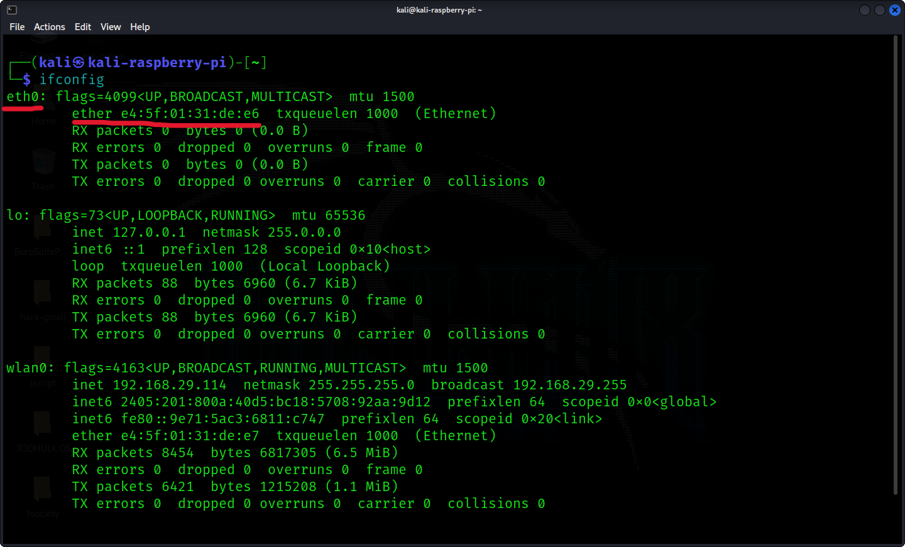
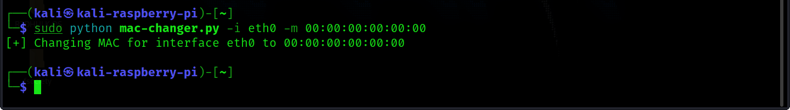

<h1><b>Mac Changer In Python</b></h1>
<h2><i>MAC Address Changer is an easy to use application that allows you to change (spoof) the Media Access Control (MAC) Address of your network adapters.</h1></i>

#
<h1><b>Look What It Can Do 👇</b></h1><br>
<h2><b><i>At First, Type `ifconfig` On Terminal.</h2></b></i><br>
<h2><b><i>We Target `eth0` </h2></b></i><br>



#
<h2><b><i>Run My Software Using Sudo Command.</h2></b></i><br>



#
<h2><b><i>See Results 👇 </h2></b></i><br>


#

<h2><b><i>Git Installation </h2></b></i><br>

```
# Git Installation
sudo apt install git

# Git Clone
git clone https://github.com/R3DHULK/mac-changer-in-python

# Change Directory
cd mac-changer-in-python

# Run This Tool
python mac-changer.py -i (interface) -m (new mac)

```
#
<h2><b><i> Show Support 👇👇👇</b></i> </h2>
<a href="https://www.buymeacoffee.com/r3dhulk"> </a><br><br>

